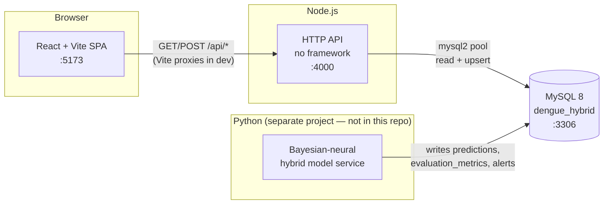
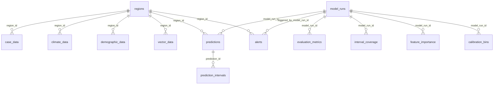

# Architecture

Companion app to the *Bayesian-Neural Hybrid Prediction Model for Dengue Virus*
study. It reads the model's output from MySQL and presents it: forecasts with
credible intervals, comparative evaluation against SARIMA and LSTM baselines,
the drivers behind each forecast, and the surveillance data that feeds training.

---

## 0. Study objective

The app exists to make four claims inspectable. Every table and every page below
traces back to one of them.

> Address the **interpretability gap** in AI models and the **accuracy gap** in
> probabilistic models by developing a Bayesian-Neural Hybrid model that:
>
> 1. **Compares predictive accuracy** against standalone LSTM and SARIMA
>    baselines using RMSE, MAE and MAPE, and determines whether the hybrid
>    outperforms both.
> 2. **Quantifies uncertainty and calibration** using CRPS (distributional
>    accuracy) and prediction-interval coverage (interval reliability).
> 3. **Identifies which factors most influence predicted cases per region**,
>    using historical epidemiological data, population, population density, mean
>    relative humidity, mean temperature and mean precipitation (stored as
   `climate_data.rainfall` — the objective's word is "precipitation", the
   column's is `rainfall`; they are the same monthly PAGASA total in mm).
> 4. **Confirms forecast uncertainty can be reliably measured and reported** as
>    a confidence/credible interval.

| Claim | Data it needs | Table | Where it surfaces |
|---|---|---|---|
| ① Point accuracy | RMSE, MAE, MAPE | `evaluation_metrics` ✅ | Model comparison ✅ |
| ② Uncertainty | CRPS, coverage by nominal level | `evaluation_metrics`, `interval_coverage` ✅ | Model comparison ✅ / Calibration ✅ |
| ③ Drivers | per-region feature effects with intervals | `feature_importance` ✅ | Drivers ✅ |
| ④ Reliable intervals | PIT bins, interval width | `calibration_bins`, `prediction_intervals` ✅ | Calibration ✅ |

✅ = built

**Every table, endpoint and page the objective needs now exists.** What remains
is the research itself: the Python model service that writes real values into
`predictions`, `evaluation_metrics`, `interval_coverage`, `calibration_bins`
and `feature_importance`. Until it runs, those tables hold clearly-labelled
demo fixtures (`npm run seed:fixtures`) and every page that reads them says so.

### Unit of analysis

The study operates on **the 17 administrative regions of the Philippines,
monthly**, over **2016-01 → 2020-12** — a complete panel of 1,020 rows
(17 × 60) with zero missing values, joined from the revised dataset.

Two properties of the source data shape the whole design. Both are evidenced in
[DATA_ASSESSMENT.md](DATA_ASSESSMENT.md) and [REVISION_PLAN.md](REVISION_PLAN.md):

- **The 2008–2016 case file is excluded.** It carries a period-3 quarterly
  artefact — peaks in March, troughs in January, rising monotonically within
  each quarter in 41% of quarters against 17% expected by chance — which is not
  epidemiology. It also fails to reconcile with the 2016–2020 file on their
  shared year.
- **2020 is excluded from headline evaluation.** July–October 2020 runs at 6–9%
  of 2019: the COVID lockdown collapsing health-seeking and surveillance, not a
  fall in transmission. The evaluation split is **train 2016–2018, test 2019**,
  with 2020 reported separately as an out-of-regime diagnostic.

The app also retains a **CALABARZON municipal view** (143 cities and
municipalities, annual, 2020–2024) built from the earlier dataset. That is a
second, finer-grained scope — useful, and the regional panel cannot reproduce
it — but it is annual, so it cannot support the forecast model.

---

## 1. System context

Three processes and one database. **The database is the contract** — the model
service and this app never call each other.



| Piece | Responsibility | In this repo? |
|---|---|---|
| **React SPA** | Everything a human sees. Holds no business logic beyond formatting and aggregation. | Yes — `frontend/` |
| **Node API** | Thin read layer over MySQL, plus the CSV bulk-upsert and JWT login. | Yes — `backend/` |
| **MySQL** | The integration point. Owns all state. | Schema in `backend/migrations/` |
| **Model service** | Trains, forecasts, writes `predictions`, `evaluation_metrics`, `interval_coverage`, `calibration_bins`, `feature_importance`. Contract: **[MODEL_SERVICE.md](MODEL_SERVICE.md)**. | **No** — still to be built |

Why this split: the model runs as a batch job on its own schedule (hours), while
the UI serves interactive reads (milliseconds). Coupling them through tables
means either can be restarted, rewritten, or run on a different machine without
touching the other. Today those tables hold seeded demo numbers; when the Python
service lands, the same UI reflects real output with no frontend change.

---

## 2. Repository layout

```
DENGUE_PREDICTIONV2/
├── .vscode/                    Editor + task/debug config
├── RESEARCH DATA SET/          Raw source data (not read by the app at runtime)
│   ├── REVISED DATA SET/       The study dataset — 17 regions, monthly
│   └── (the rest)              Earlier CALABARZON municipal dataset
├── backend/                    Node.js API
├── frontend/                   React SPA
├── markdown/
│   ├── ARCHITECTURE.md         This file
│   ├── DATA_ASSESSMENT.md      Field-level audit of the source data
│   ├── MODEL_SERVICE.md        Write contract for the Python model service
│   ├── REVISION_PLAN.md        Schema/backend/frontend changes for the objective
│   └── VSCODE_SETUP_GUIDE.md   Guided first-run walkthrough
└── README.md                   Quick scaffold reference
```

### `.vscode/` — editor configuration

Committed on purpose so everyone gets the same setup.

| File | What it does |
|---|---|
| `extensions.json` | Recommends ESLint, Prettier, a MySQL client, React snippets, REST Client, DotENV. VS Code prompts to install these on first open. |
| `tasks.json` | Defines **Backend: dev**, **Frontend: dev**, and **Run full stack** (both in parallel). Reach it with *Terminal → Run Task…* |
| `launch.json` | **Debug backend (Node + MySQL)** — runs `backend/src/server.js` under the debugger with `backend/.env` loaded, so you can breakpoint inside any controller. |
| `settings.json` | Format-on-save via Prettier, ESLint scoped to both workspaces. |

### `RESEARCH DATA SET/` — raw study inputs

Source material for the research, **not loaded by the app at runtime**. Nothing
in `backend/` or `frontend/` reads this folder; it is the raw input the Python
model service will consume.

> See **[DATA_ASSESSMENT.md](DATA_ASSESSMENT.md)** for the field-level audit and
> **[REVISION_PLAN.md](REVISION_PLAN.md)** for what still has to be built.

#### `REVISED DATA SET/` — the study dataset

Region × month, national. This is what the objective in §0 is answered from.

| Subfolder | Grain | Coverage | Fields | Use |
|---|---|---|---|---|
| Recorded Dengue Cases 2016-2020 | region × month | 2016-01 → 2020-12 | cases, deaths | **The target.** 1,020 rows, complete |
| Mean Air Temperature | region × month | 1950 → 2025 | °C | Predictor |
| Mean Precipitation | region × month | 1950 → 2025 | mm | Predictor |
| Mean Relative Humidity | region × month | 1950 → 2025 | % | Predictor |
| Number of Hot Days (>35 °C) | region × month | 1950 → 2025 | days | Predictor; blanks read as 0 |
| Population Density 2010/2015/2020 | municipality **+ region subtotals** | 3 censuses | population, **land area km²** | Population + density |
| Urban Population 2015/2020 | region + municipality | 2 censuses | urban %, count | Optional covariate |
| Poverty Threshold 2015/2018 | region | 2 years | threshold, incidence | Optional covariate |
| Population 2022-2025 | region × year | 2022–2025 | totals, age/sex | **Unused** — no overlap with the case window |
| Dengue Cases Per 100k 2008-2016 | region × month | 2008 → 2016 | rate per 100k | **Excluded** — period-3 artefact (§0) |

Four different region vocabularies appear across these files
(`Region.IV.A` / `Region IV-A` / `Region 4-A` / `REGION IV-A (CALABARZON)`, plus
`ARMM`↔`BARMM` and `CARAGA`↔`Region XIII`). Canonicalising them is a
prerequisite for any join, and the geography extraction reconciles exactly
against PSA's own national total of 109,033,245.

#### The earlier CALABARZON dataset

Municipality × year, one region. Feeds the municipal risk map only.

| Subfolder | Contents |
|---|---|
| `Historical Dengue Data/` | Per-municipality case counts, 2020–2024 (PDF) plus a consolidated `.xlsx` |
| `PAGASA DATA - .../` | Monthly rainfall, humidity, min/max temperature per weather station (CSV) |
| `Population Per Municipality/` | Population figures (`.xlsx`) |
| `Human Development Index/` | HDI by area, 2009 and 2012 (`.xlsx`) |

---

## 3. `backend/` — the API

Plain Node.js `http`. **No Express** — deliberate, so the dependency surface
stays at four packages: `mysql2`, `dotenv`, `jsonwebtoken`, `bcryptjs`.

```
backend/
├── migrations/
│   ├── 001_initial_schema.sql      The original ten tables
│   ├── 002_objective_alignment.sql Tables and columns for objectives ②–④
│   ├── 003_region_identity.sql     Unique key on region identity
│   └── 004_model_output_keys.sql   Makes the model service's writes idempotent
├── scripts/                One-shot data pipelines (not part of the server)
│   ├── etl/
│   │   ├── normalize.js        Municipal name keys, OCR repair map
│   │   ├── sources.js          Readers for the CALABARZON workbooks + PAGASA
│   │   ├── regions-ph.js       The 17 regions and their 4 source vocabularies
│   │   └── revised-sources.js  Readers for the REVISED DATA SET
│   ├── import-revised-dataset.js The study panel → MySQL
│   ├── seed-model-fixtures.js    DEMO model output for the new tables
│   ├── import-research-data.js   CALABARZON municipal data → MySQL
│   ├── build-boundaries.js       geoBoundaries → the map's GeoJSON
│   └── dedupe-seed-artifacts.js  Removes duplicate rows from a double seed
├── src/
│   ├── config/
│   │   ├── db.js           mysql2 pool + query() helper
│   │   ├── migrate.js      Versioned migration runner + ledger
│   │   └── seed.js         Demo regions, user, 3 model runs, forecast, alerts
│   ├── controllers/        One file per resource; owns its SQL
│   ├── middleware/
│   │   ├── auth.js         JWT verify + role check
│   │   └── cors.js         CORS headers
│   ├── routes/
│   │   ├── router.js       ~40-line method+path matcher
│   │   └── index.js        The route table
│   ├── utils/http.js       sendJson() + readJsonBody()
│   └── server.js           Entry point
├── .env                    Your credentials — gitignored
├── .env.example            Template to copy
└── requests.http           Clickable requests for the REST Client extension
```

### Request lifecycle

```
http.createServer  →  applyCors(res)
                   →  OPTIONS? → 204, done
                   →  router.handle(req, res)
                        ├─ match method + path regex
                        ├─ populate req.params / req.query
                        └─ await handler(req, res)
                              ├─ query(sql, namedParams)   ← src/config/db.js
                              └─ sendJson(res, 200, rows)  ← src/utils/http.js
                   →  no match? → 404
                   →  threw?    → logged, 500
```

### Folder responsibilities

**`config/`** — `db.js` creates one pooled connection (limit 10) with
`namedPlaceholders: true`, so controllers write `:regionId` instead of counting
`?`. It exports `query()`, a thin wrapper that returns rows directly; controllers
never touch the pool.

`migrate.js` applies every `NNN_*.sql` in `migrations/` once, in filename order,
recording each in a `schema_migrations` ledger. The ledger is what makes
`npm run migrate` safe to run at any time: MySQL has no
`ALTER TABLE ... ADD COLUMN IF NOT EXISTS`, so a second run of an ALTER-based
migration is an error, not a no-op. A database created before the ledger existed
is detected and *baselined* — 001 is recorded as already applied rather than
re-run against tables that exist.

Its statement splitter is a character scanner rather than a `split(';')`,
because a `;` inside a `COMMENT '...'` literal is not a statement boundary. The
naive version cut an `ALTER TABLE` in half.
`seed.js` populates enough demo data that no page is empty on first run, inside a
single transaction that rolls back on failure.

**`controllers/`** — one file per resource, each owning its own SQL. There is no
repository or ORM layer: the queries are short and reading them beside the
handler is clearer than indirection. `modelsController` joins `model_runs` to
`evaluation_metrics` so the comparison arrives in one call, ordered best-RMSE
first. `casesController.bulkInsertCases` upserts via
`ON DUPLICATE KEY UPDATE`, which is what makes re-uploading a corrected week
overwrite rather than duplicate.

**`middleware/`** — not Express middleware. There is no chain to plug into, so
`getAuthUser(req)` and `requireRole(...)` are plain functions a controller calls
when it wants them. Nothing is enforced globally.

**`routes/`** — `router.js` compiles `/api/predictions/:regionId` into a regex,
remembers the param names, and populates `req.params` / `req.query` on a match.
`index.js` is the whole route table, eight lines of registration.

**`scripts/`** — the data pipelines. They run by hand, never from the server,
and they are the only writers of observed data.

`import-research-data.js` loads `RESEARCH DATA SET/` into `regions`,
`case_data`, `climate_data` and `demographic_data`. It deliberately never
touches `model_runs`, `predictions`, `evaluation_metrics` or `alerts` — those
belong to the model service.

```bash
npm run etl -- --dry-run              # parse and report, write nothing
npm run etl                           # upsert (idempotent — safe to re-run)
npm run etl -- --reset                # clear the four tables first
npm run etl -- --only=regions,climate # partial load
npm run etl -- --laguna-proxy=Ambulong
```

The source data is dirty in ways that fail silently, so the ETL repairs each
defect *and reports it on every run* — a quiet pipeline over this input would
be lying. What it handles (all measured in [DATA_ASSESSMENT.md](DATA_ASSESSMENT.md)):

| Defect | Handling |
|---|---|
| Eleven OCR-corrupted municipality names | Repaired via an explicit map in `normalize.js` — `UMACA`→Gumaca, four spellings of Mataasnakahoy, etc. |
| Missing province column | Recovered from the sheet's province-block order, with a purity check that fails loudly if a future sheet breaks the layout. This is what splits the two Rosarios. |
| PAGASA `-999` sentinel | Converted to `NULL`. It is a valid number, so `isna()` never sees it. |
| Blank TOTAL cells (10 rows, 2021) | Dropped, **never read as zero** — a zero would teach the model a case crash that never happened. |
| A town written twice with the same value | Collapsed, and reported. |
| A town written twice with *different* values | Summed and flagged as unresolvable from the workbook. |
| Three PAGASA stations in Quezon | Averaged per province-month; the schema is keyed `(region_id, date)` so they would otherwise collide. |
| Laguna has no weather station | Left empty unless `--laguna-proxy` is passed, so substituting a neighbour is a recorded decision, not an ETL-level guess. |

`import-revised-dataset.js` loads the **study panel** — the 17 regions and
their 60 months — into the same four tables, scoped to `admin_level='region'`
so the municipal rows are untouched.

```bash
npm run etl:revised -- --dry-run   # parse and report, write nothing
npm run etl:revised                # 17 regions, 1,020 cases, 1,020 climate, 119 demographic
npm run etl:revised -- --reset     # clear this ETL's rows first
```

It asserts rather than assumes, and refuses to write if an assertion fails:

| Guard | Why |
|---|---|
| The 17 regional populations must sum to **109,033,245** | That single check is what proves the region rows were picked correctly out of a hierarchy that mixes regions, provinces and municipalities with no level column. |
| The 2008–2016 rate file is **refused**, with the evidence re-derived each run | It prints the period-3 statistic (41.2% of quarters rising vs 16.7% by chance) and the peak/trough months. If the file is ever corrected the guard stops firing on evidence, not on faith. |
| Look-alikes are **reported, not silently dropped** | A municipality named *Caraga* in Davao Oriental otherwise passes for Region XIII. |
| Blank `hot_days` cells are **counted** as they are written as 0 | 617 of them. ERA5 leaves a month blank when no day exceeded 35 °C, which in this climate is far likelier than "not measured" — but it is an assumption and is stated. |
| `demographic_data.source` marks census vs interpolated | 2016–2019 population is linear between the 2015 and 2020 censuses. There is no annual census to read. |

`build-boundaries.js` fetches geoBoundaries **gbOpen PHL ADM3 + ADM2**
(CC-BY 4.0, no account, no API key), assigns each municipality its province by
point-in-polygon — ADM3 carries no parent, and this is what disambiguates
Rosario a second time — matches all 143 against the PSA gazetteer, and writes
`frontend/public/calabarzon-lgus.geojson` (259 kB). With `--update-regions` it
also writes centroids into `regions.lat/lng` — **for the ADM3 municipalities
only**. The 17 region rows keep `lat`/`lng` NULL, so nothing in the app can
place a regional marker; regional geography is carried entirely by the polygons
in `ph-regions.geojson`.

It also builds the **national ADM1 layer** (`ph-regions.geojson`, 17 regions,
318 kB) that the risk map's regional scope renders.

It runs **once** and its output is committed, so the app makes no external
request at runtime. Downloads are cached in `scripts/.cache/` (gitignored).

> **Correction.** An earlier version of this document said Douglas-Peucker
> removed nothing because "geoBoundaries' simplified layer is already coarser
> than eps". That was wrong. The simplifier was broken: a GeoJSON ring is
> *closed*, so its first and last vertex are identical, the initial baseline had
> zero length, every perpendicular distance measured 0, nothing ever cleared
> eps, and the function returned its input untouched. Anchoring on the vertex
> farthest from the start splits the ring into two open polylines and fixes it.
> The national layer went 71,679 → 19,169 points (−73%) and the municipal layer
> 12,807 → 7,700 (−40%), so the committed CALABARZON map had been ~36% larger
> than necessary since it was first built.

### API surface

| Method | Path | Returns |
|---|---|---|
| GET | `/api/regions?level=` | Regions, scoped by `admin_level`. Always pass a level — the unscoped list mixes the 17 study regions with 146 municipalities |
| GET | `/api/cases?regionId=` | Up to 500 case rows, newest first |
| GET | `/api/cases/annual` | Per-LGU annual totals + census denominator (feeds the municipal map) |
| POST | `/api/cases/bulk` | Upserts `{ rows: [...] }`, returns `{ inserted }` |
| GET | `/api/predictions/:regionId` | Latest run's forecast for one region |
| GET | `/api/models/compare` | Runs joined to metrics, best RMSE first |
| GET | `/api/alerts` | Up to 200 alerts with region name, newest first |
| POST | `/api/auth/login` | `{ token, user }` — JWT valid 8h |

Serving objectives ②–④:

| Method | Path | Returns | Objective |
|---|---|---|---|
| GET | `/api/panel?region=&from=&to=` | The joined monthly panel — 1,020 rows: cases, incidence, and every predictor | ③ |
| GET | `/api/models/compare?scope=` | Point + probabilistic metrics, `overall` or per `region` | ①, ② |
| GET | `/api/models/:runId/coverage` | Nominal vs empirical coverage, with `gap` and `mean_width` | ②, ④ |
| GET | `/api/models/:runId/calibration` | PIT bins | ④ |
| GET | `/api/models/:runId/importance?regionId=` | Feature effects with credible intervals and `crosses_zero` | ③ |

Two API-design choices carry study meaning rather than convenience:

- **`crosses_zero` is computed server-side.** An effect whose credible interval
  spans zero is not distinguishable from no effect, and a ranking that hides
  that is a leaderboard pretending to be an explanation. Deriving it once in
  SQL means no client can forget to.
- **`mean_width` travels with every coverage row.** Coverage alone is not
  evidence: an interval wide enough to contain every plausible value has
  perfect coverage and no decision value. The pair is the claim.

### A trap specific to this codebase

The pool runs with `namedPlaceholders: true`, so mysql2 scans the **entire**
statement for `:name` — including inside `--` comments. A comment containing a
timestamp written with colons registers `:00` as a bind parameter and the query
dies with *"Bind parameters must not contain undefined"*. **Never put a colon
in a SQL comment here.**

Relatedly, every `DATE` column is `DATE_FORMAT`-ed before it leaves an endpoint.
mysql2 returns a DATE as a JS Date at local midnight, which JSON-encodes to the
previous day in UTC+8 — a `train_start` stored as `2016-01-01` reaches the
client reading `2015-12-31`. The panel exposes `period` (`YYYY-MM`) for the
same reason: it is the field to key on, not `date`.

**Two response quirks the frontend must handle** (both are mysql2 behaviour, not
bugs):

- `DECIMAL` columns arrive as **strings** — `"28.300"`, not `28.3`. Anything
  numeric goes through `toNumber()` before arithmetic or comparison.
- `DATE` columns arrive as **full ISO timestamps at local midnight** —
  `"2026-08-02T16:00:00.000Z"` is 3 August in UTC+8. Formatting in the viewer's
  local zone puts them back on the intended day.

### Database schema

Fourteen tables plus a migration ledger. `regions` is the hub; everything else
hangs off it by `region_id` with `ON DELETE CASCADE`. The four tables that carry
objectives ②–④ were added by `002_objective_alignment.sql` and are empty until
the model service writes to them.



| Table | Written by | Notes | Objective |
|---|---|---|---|
| `regions` | ETL | The hub. `slug` (unique), `admin_level`, `land_area_km2` — holds both the 17 regions and the 143 municipalities (plus 3 legacy seed rows, below). | — |
| `case_data` | ETL + CSV upload | `period_type` (week/month/year) so monthly regional rows and annual municipal rows can never be summed together. | ①–④ |
| `climate_data` | ETL | Temperature, `rainfall` (mm/month), humidity, `hot_days`. `enso_index` **empty** — see below. | ③ |
| `demographic_data` | ETL | Population, `population_density`, `urban_pct`, `poverty_rate`, by year. `source` marks census vs interpolated vs carried. | ③ |
| `vector_data` | — | Larval index, adult density. **Empty** — no entomological data exists in either dataset. | — |
| `model_runs` | model service | One row per training run, with its train/test window and feature set — without those the comparison is unreproducible. | ①–④ |
| `predictions` | model service | `predicted_cases`, `ci_lower`, `ci_upper`. | ①, ④ |
| `evaluation_metrics` | model service | RMSE, MAE, MAPE, CRPS, coverage. | ①, ② |
| `alerts` | model service | `risk_level` ENUM low/moderate/high/severe. | — |
| `users` | seed | bcrypt `password_hash`, role ENUM. | — |
| `prediction_intervals` | model service | An interval per nominal level (50/80/95). `ci_lower`/`ci_upper` alone carry no statement of *what* interval they are. | ②, ④ |
| `interval_coverage` | model service | Nominal vs empirical coverage + mean width. Coverage without width is not evidence — a wide enough interval always covers. | ②, ④ |
| `feature_importance` | model service | Per-run, per-region, per-feature effect **with an uncertainty interval**. The interval is what separates interpretability from a leaderboard. | ③ |
| `calibration_bins` | model service | PIT histogram. Flat = calibrated, U-shaped = overconfident. | ④ |
| `schema_migrations` | `npm run migrate` | Ledger of applied migrations. | — |

Only `case_data` is writable through the API. Everything the model produces is
read-only here by design.

### 3a. What is actually populated

A schema column is a promise, not a fact. These are the row counts as loaded by
`npm run etl:revised`, so the gap between "the table has this column" and "this
column has data" is visible rather than discovered later by a chart that renders
empty.

| Table | Rows | Populated | Empty or partial |
|---|---|---|---|
| `case_data` | 1,020 month · 692 year · 4 week | Monthly = the 17-region study panel, 2016-01 → 2020-12. Annual = CALABARZON LGUs. | The 4 weekly rows are pre-revision demo data and belong to no objective. |
| `climate_data` | 7,740 | `temperature`, `rainfall`, `humidity` on 7,706 | `enso_index` **0 of 7,740** — no ENSO/ONI series exists in the revised dataset. `hot_days` only on the 1,020 regional rows. |
| `demographic_data` | 687 | `population` on all 687 | `population_density` and `urban_pct` on **119** (17 regions × 2015–2021); `poverty_rate` on **102** (17 × 2015–2020). The other 568 are CALABARZON municipal rows, which carry population only. |
| `vector_data` | 0 | — | **Empty.** No larval or adult-density data exists in either dataset. Objective ③ is answered from climate and demography alone. |
| `regions.lat/lng` | 163 rows | 146 of 146 municipality rows have centroids | **0 of 17 region rows.** `build-boundaries.js --update-regions` writes centroids for the ADM3 layer only. This is why the risk map is a choropleth over `ph-regions.geojson` and not a marker map — there are no regional coordinates to place a marker on. |

`demographic_data.source` records provenance per row, so an interpolated figure
is never mistaken for a measured one:

| `source` | Rows | Meaning |
|---|---|---|
| `census` | 34 | A PSA census year read directly (2015, 2020). |
| `interpolated` | 51 | Population linearly interpolated between censuses (2016–2019). |
| `census+poverty:carried` | 17 | Census population; poverty carried forward from the 2018 FIES — there is no 2020 release in the dataset. |
| `interpolated+poverty:carried` | 17 | Both approximations at once. Treat with the most caution. |
| `NULL` | 568 | Pre-revision municipal rows, loaded before `source` existed. |

**Three legacy rows.** `regions` also holds ids 1, 3 and 4 — "Metro Manila",
"Davao Region" and "Central Visayas" — stored at `admin_level = 'municipality'`
although they name regions. They predate the revision and duplicate NCR,
Region XI and Region VII. Two of them still carry demo alerts, which is why
`/api/alerts` defaults to `?level=region`. They are harmless but not real; delete
them once nothing references them.

---

## 4. `frontend/` — the SPA

React 18 + Vite 5, React Router 6, Recharts, Axios. No UI framework and no CSS
library — the design system is local, which is why the whole stylesheet is 26 kB.

```
frontend/
├── index.html              Fonts + pre-paint theme stamp
├── vite.config.js          Dev server on :5173, proxies /api → :4000
└── src/
    ├── main.jsx            Provider tree
    ├── App.jsx             Routes
    ├── index.css           Imports the three style layers
    ├── styles/             Design system  (tokens → base → components)
    ├── theme/              Light/dark/system context
    ├── components/         Reusable UI
    ├── pages/              One per route
    ├── services/api.js     Every HTTP call
    ├── hooks/useFetch.js   Generic async-state hook
    └── lib/                Formatting + chart-token helpers
```

### Data flow

```
pages/*.jsx
   └─ useFetch(() => someApi.method(), [deps])   ← hooks/useFetch.js
        └─ services/api.js  (axios; attaches Bearer token if present)
             └─ /api/*  →  Vite proxy in dev  →  :4000
   ↓
returns { data, error, loading, refetch }
   ↓
<AsyncSection> picks one of: error → skeleton → empty → content
   ↓
formatted through lib/format.js, rendered by components/
```

There is **no global store**. Each page fetches what it needs; the only shared
state is auth (`context/AuthContext.jsx`) and theme (`theme/ThemeContext.jsx`).
For five pages and seven endpoints, Redux or React Query would be more machinery
than the problem needs.

### Folder responsibilities

**`styles/`** — three layers, imported in order by `index.css`:

- **`tokens.css`** — the single source of truth. Surfaces, ink, lines, spacing,
  radius, type scale, and the colour palette, all as CSS custom properties. Light
  and dark are both defined here; nothing downstream hardcodes a hex.
- **`base.css`** — reset, typography, focus rings, `prefers-reduced-motion`, and
  a few text utilities.
- **`components.css`** — every component class: shell, sidebar, cards, tables,
  badges, buttons, charts, states, responsive breakpoints.

The colour palette is **validated, not chosen by eye**. The categorical series
slots were derived from the brand teal and checked with a colour-vision-deficiency
validator (OKLab ΔE under simulated protanopia and deuteranopia, lightness band,
chroma floor, contrast against the actual surface) in both modes:

- light on `#FFFFFF` — all checks pass, worst adjacent CVD ΔE **9.3**
- dark on `#14181A` — all checks pass, worst adjacent CVD ΔE **12.6**

The original brand `#0F5C4F` failed the chroma floor (0.095 against a 0.10
minimum — below that a hue reads as grey and stops carrying identity), so series
slot 1 is `#00887A`. Separately, white text on that teal measures only 4.37:1,
so filled buttons use a darker `--accent-solid` (5.04:1) while marks keep
`--accent`. Risk levels use a **reserved status scale**, never a series colour,
and every badge pairs its colour with an icon and a written label — so the level
is never carried by colour alone.

**`theme/ThemeContext.jsx`** — three-way preference (light / dark / **system**),
persisted to `localStorage`. It always stamps the *resolved* value onto
`<html data-theme>`, which is what lets an explicit light choice beat an OS-dark
preference. An inline script in `index.html` does the same stamp before first
paint, so a dark-mode load never flashes white.

**`components/`**

| File | Role |
|---|---|
| `Layout.jsx` | App shell: grouped sidebar nav with a live alert count, sticky topbar, theme toggle, mobile drawer, skip link. |
| `Card.jsx` | `Card` / `CardHead` / `CardBody` / `CardFoot`. |
| `StatCard.jsx` | Stat tile: label, value, unit, delta, sublabel, sparkline. |
| `Sparkline.jsx` | 12-point inline SVG trend line. |
| `RiskBadge.jsx` | Status badge — colour **+ icon + label**, always all three. |
| `DataTable.jsx` | Column-driven table; numeric columns get `tabular-nums`. |
| `States.jsx` | `AsyncSection`, `EmptyState`, `ErrorState`, skeletons. |
| `Controls.jsx` | `PageHeader`, `Select`, `ViewToggle`, `Notice`, `LegendItem`. |
| `ChartTooltip.jsx` | Shared Recharts tooltip — value leads, series name follows. |
| `AccountMenu.jsx` | Sign-in popover over the existing `AuthContext`. |
| `Icon.jsx` | 30 inline stroke icons. No icon font, no network request. |
| `Formula.jsx` | MathML block/inline maths. Goes through `dangerouslySetInnerHTML` because React 18 builds elements in the HTML namespace, so MathML written as JSX renders as inert unknown tags; the browser's own parser is what switches namespace. The markup is static and author-written. |

**`States.jsx` is worth calling out.** `AsyncSection` is the one place that
decides between loading / error / empty / content, so every card in the app
resolves those four states identically. On a *refetch* it holds the previous
render at reduced opacity instead of swapping in a skeleton — no flash, no
layout jump.

**`pages/`**

| Page | Route | What it shows |
|---|---|---|
| `Dashboard.jsx` | `/` | One hero figure (regions at high risk or above), four stat tiles, recent alerts, current risk per region. |
| `RiskMap.jsx` | `/map` | Two scopes: the 17 regions (monthly, the study panel) and the 143 CALABARZON LGUs (annual). Year/month/metric selectors, ranked list, table twin. |
| **Calibration** *(planned)* | `/calibration` | Reliability diagram (nominal vs empirical coverage against the 45° ideal), PIT histogram, mean interval width. Objective ④ made visible. |
| `Drivers.jsx` | `/drivers` | Objective ③. Signed effects with credible intervals; zero-crossing effects render hollow and labelled. Diverging palette. |
| `Mathematics.jsx` | `/mathematics` | Every formula behind the other pages, each paired with the decision it changes. Maths is native **MathML** — no KaTeX or MathJax, so the page keeps the app's zero-external-request property. |
| `Forecast.jsx` | `/forecast` | Observed counts + forecast on one axis, credible interval as a range band. Opens on the highest-risk region. |
| `ModelComparison.jsx` | `/models` | Five metrics as five small charts, plus the metrics table. |
| `DataManagement.jsx` | `/data` | CSV dropzone with in-browser parsing and validation, region-id reference, recent records. |
| `Alerts.jsx` | `/alerts` | Risk-level filter, per-level counts, full alert table. |

**`lib/`** — `format.js` holds `toNumber()`, date/number formatters, and the risk
ordering. `useChartTheme.js` resolves the CSS custom properties into concrete
values for Recharts (which writes colours into SVG attributes, and whose
internals don't all accept `var()`), re-reading them whenever the theme changes.

### Charting decisions

Four choices that are load-bearing rather than cosmetic:

- **The map is hand-drawn SVG, not a map library.** No tile server, no API key,
  no runtime request: `Choropleth.jsx` projects the committed GeoJSON itself.
  At 2.3° across, an equirectangular projection with a `cos(lat)` width
  correction is sub-pixel accurate, so a real projection would be ceremony.
  Colour is **sequential** — one hue, low-to-high — and the bins are computed
  across *all five years* so switching year shows real change instead of a
  repainted scale. "No data" sits outside the ramp, because absence is not a
  low value.

- **The credible interval is a real range band.** Recharts draws a band when a
  `dataKey` resolves to a `[lo, hi]` pair. The alternative — painting a
  background-coloured area over the lower bound — only works while the page
  behind the chart is one opaque colour, and breaks the moment a theme changes.
- **Model comparison is five small charts, not one.** RMSE (~28–42 cases), MAPE
  (~11–18 %) and coverage (~68–90 %) are three different scales. Putting any two
  on one plot needs a second y-axis, and the alignment between two y-axes is
  arbitrary — it invents a correlation that isn't in the data. Each metric gets
  its own chart and its own scale; each model keeps its colour across all five.
- **Colour follows the entity, never its rank.** The hybrid is pinned to series
  slot 1 because it is the subject of the study, not because it is currently
  winning. Sorting or filtering can never repaint a model the reader has already
  learned.

Every chart ships a **table view** showing the same numbers, so no value is
reachable only by hovering.

---

## 5. Running the project

### Prerequisites

| Tool | Version | Check |
|---|---|---|
| Node.js | 18 LTS+ | `node -v` |
| npm | ships with Node | `npm -v` |
| MySQL Server | 8.x, running | `mysql --version` |

On Windows `mysql` is often not on `PATH`. Either add
`C:\Program Files\MySQL\MySQL Server 8.0\bin`, or call the binary directly —
substitute the full path in the commands below.

---

### Step 1 — Create the database

```bash
mysql -u root -p -e "CREATE DATABASE IF NOT EXISTS dengue_hybrid CHARACTER SET utf8mb4"
```

<details>
<summary>PowerShell, with the full path</summary>

```powershell
& "C:\Program Files\MySQL\MySQL Server 8.0\bin\mysql.exe" -u root -p -e "CREATE DATABASE IF NOT EXISTS dengue_hybrid CHARACTER SET utf8mb4"
```
</details>

### Step 2 — Configure the backend

```bash
cd backend
cp .env.example .env
```

Open `.env` and fill in your real MySQL credentials:

```ini
DB_HOST=localhost
DB_PORT=3306
DB_USER=root
DB_PASSWORD=your_password_here
DB_NAME=dengue_hybrid

PORT=4000
JWT_SECRET=any_long_random_string
```

`.env` is gitignored. Never commit it.

### Step 3 — Install, migrate, seed

```bash
cd backend
npm install
npm run migrate     # creates all 10 tables from migrations/schema.sql
npm run seed        # demo regions, user, 3 model runs, a forecast, 2 alerts
```

Expected output:

```
Migration complete: 10 statements executed.
Seed complete. Demo login: admin@dews.local / password123
```

Both commands are safe to re-run. `migrate` is idempotent; `seed` will add
duplicate model runs if run repeatedly, so run it once.

### Step 4 — Start the backend

```bash
cd backend
npm run dev         # node --watch, restarts on save
```

You should see `API server listening on http://localhost:4000`. **Leave this
terminal running.**

Sanity check — open `backend/requests.http` in VS Code and click **Send Request**
above `GET /api/regions`. Four regions come back as JSON in the editor. Or:

```bash
curl http://localhost:4000/api/regions
```

### Step 4b — (Optional) Load the real CALABARZON data

`npm run seed` gives you four placeholder regions. To run the app against the
actual research dataset instead — 143 municipalities, 692 annual case records,
6,720 monthly climate rows:

```bash
cd backend
npm run etl -- --dry-run    # look at the defect report first
npm run etl
npm run etl:boundaries -- --update-regions
```

`etl:boundaries` needs internet the first time (it caches the download); the
ETL itself does not. Both are idempotent.

### Step 5 — Start the frontend

In a **second terminal** (`` Ctrl+Shift+` `` in VS Code):

```bash
cd frontend
npm install
npm run dev
```

Open **http://localhost:5173**. The dashboard should show `1 of 4` regions at
high risk, the Bayesian-Neural Hybrid as the leading model, and two alerts.

> **Shortcut:** instead of two terminals, use *Terminal → Run Task… →*
> **Run full stack**, which starts both dev servers in parallel.

### Step 6 — Look around

- **Theme toggle** (top right) cycles light → dark → match system.
- **Account** (top right) signs in with `admin@dews.local` / `password123`.
- **Chart / Table** toggles on Forecast and Model comparison show the same
  numbers two ways.

---

### Other commands

| Where | Command | Does |
|---|---|---|
| `backend/` | `npm run dev` | Dev server with `--watch` auto-restart |
| `backend/` | `npm start` | Run once, no watch |
| `backend/` | `npm run migrate` | Apply `schema.sql` |
| `backend/` | `npm run seed` | Load demo data |
| `backend/` | `npm run etl:revised` | Load the study panel — 17 regions × 60 months |
| `backend/` | `npm run etl` | Load the CALABARZON municipal dataset |
| `backend/` | `npm run etl:boundaries` | Rebuild the map's GeoJSON |
| `backend/` | `npm run seed:fixtures` | DEMO model output so the new pages have data |
| `backend/` | `npm run dedupe` | Report (or `-- --apply`) duplicate rows from a double seed |
| `frontend/` | `npm run dev` | Vite dev server, port 5173 |
| `frontend/` | `npm run build` | Production bundle into `dist/` |
| `frontend/` | `npm run preview` | Serve the built bundle |

### Debugging the backend

*Run and Debug* (`Ctrl+Shift+D`) → **Debug backend (Node + MySQL)** → `F5`.
Loads `.env` automatically, so you can breakpoint inside any controller and
inspect SQL results live.

---

## 6. Troubleshooting

| Symptom | Cause and fix |
|---|---|
| `ECONNREFUSED` on backend start | MySQL isn't running, or `.env` credentials are wrong. |
| `ER_ACCESS_DENIED_ERROR` / `ERROR 1045` | Wrong `DB_USER`/`DB_PASSWORD` in `.env`. |
| `ER_NOT_SUPPORTED_AUTH_MODE` | `ALTER USER 'root'@'localhost' IDENTIFIED WITH mysql_native_password BY 'your_password';` |
| `EADDRINUSE` on port 4000 | Something is already listening. PowerShell: `Get-NetTCPConnection -LocalPort 4000 -State Listen \| ForEach-Object { Stop-Process -Id $_.OwningProcess -Force }` |
| Pages stuck on skeletons | Backend isn't running, or isn't on 4000. Check terminal one. |
| `/api/auth/login` returns 401 | Run `npm run seed`, or re-check the email/password. |
| Forecast page empty for a region | Only regions with rows in `predictions` have a forecast — the seed writes one for the first region only. Other regions correctly show an empty state. |
| Frontend builds but styles are missing | `index.css` must import all three files in `src/styles/` in order: tokens → base → components. |

---

## 7. Extending it

**Adding an endpoint** — three edits: a handler in `backend/src/controllers/`,
a line in `backend/src/routes/index.js`, a method in
`frontend/src/services/api.js`. Then call it from a page with `useFetch`.

**Adding a page** — a file in `frontend/src/pages/`, a `<Route>` in `App.jsx`,
and an entry in the `NAV` array plus the `TITLES` map in
`components/Layout.jsx`.

**Changing the look** — edit `frontend/src/styles/tokens.css`. Nothing
downstream hardcodes a colour. If you change a **series** colour, re-run the
palette validation rather than eyeballing it: CVD separation and contrast are
measurable properties, and a palette that looks fine to you can collapse for a
colourblind reader.

**Wiring up the real model** — nothing here changes. Have the Python service
insert into `model_runs`, `predictions`, `evaluation_metrics` and `alerts` and
the UI reflects it on next load. Two things to honour:

- Give each run a distinct `trained_at`. `/api/predictions/:regionId` selects the
  newest run by `trained_at DESC, id DESC`; the `id` tiebreak exists because the
  seeded runs share a timestamp, and without it MySQL can return a run that has
  no prediction rows.
- Write `evaluation_metrics` for every run you want in the comparison —
  `/api/models/compare` uses an inner join, so a run without metrics is invisible
  there.

Once the tables in §3 marked **planned** exist, the model service also writes
`prediction_intervals`, `interval_coverage`, `calibration_bins` and
`feature_importance`. Four things the study's own claims depend on:

- **Record the train/test window on every run.** "The hybrid beat SARIMA" is
  unreproducible without it — a reader cannot tell what was fitted on what.
  The split this study uses is train 2016–2018, test 2019, 2020 excluded (§0).
- **Emit intervals at more than one nominal level.** Calibration is the
  agreement between nominal and empirical coverage *across* levels; a single
  95% band cannot demonstrate it.
- **Report interval width alongside coverage.** An interval wide enough to
  contain everything has perfect coverage and no value.
- **Give every feature effect an uncertainty interval.** Objective ③ asks which
  factors *most influence* cases; a ranking without intervals cannot say that a
  factor's effect is indistinguishable from zero. Expect population density to
  land there — with 17 regions the cross-sectional correlation with incidence is
  −0.042, so the honest answer is likely "no detectable effect", and the UI must
  be able to say so.
