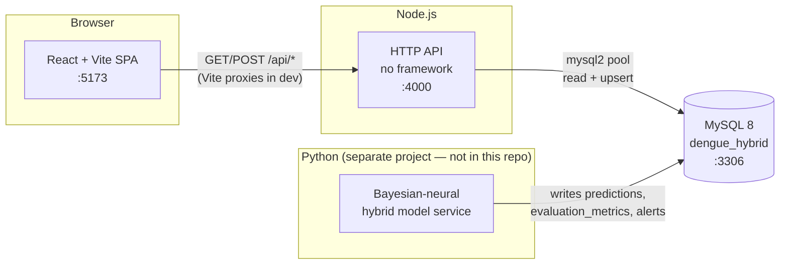
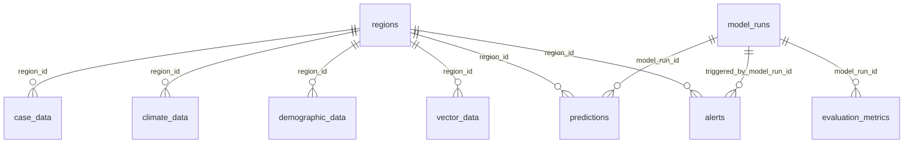

# Architecture

Companion app to the *Bayesian-Neural Hybrid Prediction Model for Dengue Virus*
study. It reads the model's output from MySQL and presents it: forecasts with
credible intervals, comparative evaluation against SARIMA and LSTM baselines,
region-level risk alerts, and the case-surveillance data that feeds training.

---

## 1. System context

Three processes and one database. **The database is the contract** — the model
service and this app never call each other.



| Piece | Responsibility | In this repo? |
|---|---|---|
| **React SPA** | Everything a human sees. Holds no business logic beyond formatting and aggregation. | Yes — `frontend/` |
| **Node API** | Thin read layer over MySQL, plus the CSV bulk-upsert and JWT login. | Yes — `backend/` |
| **MySQL** | The integration point. Owns all state. | Schema in `backend/migrations/` |
| **Model service** | Trains, forecasts, writes `predictions` / `evaluation_metrics` / `alerts`. | **No** — still to be built |

Why this split: the model runs as a batch job on its own schedule (hours), while
the UI serves interactive reads (milliseconds). Coupling them through tables
means either can be restarted, rewritten, or run on a different machine without
touching the other. Today those tables hold seeded demo numbers; when the Python
service lands, the same UI reflects real output with no frontend change.

---

## 2. Repository layout

```
DENGUE_PREDICTIONV2/
├── .vscode/               Editor + task/debug config
├── RESEARCH DATA SET/     Raw source data (not read by the app)
├── backend/               Node.js API
├── frontend/              React SPA
├── ARCHITECTURE.md        This file
├── README.md              Quick scaffold reference
└── VSCODE_SETUP_GUIDE.md  Guided first-run walkthrough
```

### `.vscode/` — editor configuration

Committed on purpose so everyone gets the same setup.

| File | What it does |
|---|---|
| `extensions.json` | Recommends ESLint, Prettier, a MySQL client, React snippets, REST Client, DotENV. VS Code prompts to install these on first open. |
| `tasks.json` | Defines **Backend: dev**, **Frontend: dev**, and **Run full stack** (both in parallel). Reach it with *Terminal → Run Task…* |
| `launch.json` | **Debug backend (Node + MySQL)** — runs `backend/src/server.js` under the debugger with `backend/.env` loaded, so you can breakpoint inside any controller. |
| `settings.json` | Format-on-save via Prettier, ESLint scoped to both workspaces. |

### `RESEARCH DATA SET/` — raw study inputs

Source material for the research, **not loaded by the app at runtime**. Nothing
in `backend/` or `frontend/` reads this folder; it is the raw input the Python
model service will consume.

> See **[DATA_ASSESSMENT.md](DATA_ASSESSMENT.md)** for a file-by-file audit —
> what is usable, the transcription defects to repair first, and why the case
> data cannot yet support a weekly forecast.

| Subfolder | Contents |
|---|---|
| `Historical Dengue Data/` | Per-municipality case counts, 2020–2024 (PDF) plus a consolidated `.xlsx` |
| `PAGASA DATA - .../` | Monthly rainfall, humidity, min/max temperature per weather station (CSV) |
| `Population Per Municipality/` | Population figures (`.xlsx`) |
| `Human Development Index/` | HDI by area, 2009 and 2012 (`.xlsx`) |

---

## 3. `backend/` — the API

Plain Node.js `http`. **No Express** — deliberate, so the dependency surface
stays at four packages: `mysql2`, `dotenv`, `jsonwebtoken`, `bcryptjs`.

```
backend/
├── migrations/
│   └── schema.sql          Every CREATE TABLE, idempotent
├── scripts/                One-shot data pipelines (not part of the server)
│   ├── etl/
│   │   ├── normalize.js    Name keys, OCR repair map, station→province
│   │   └── sources.js      Readers for the workbooks and the PAGASA CSVs
│   ├── import-research-data.js   RESEARCH DATA SET → MySQL
│   └── build-boundaries.js       geoBoundaries → the map's GeoJSON
├── src/
│   ├── config/
│   │   ├── db.js           mysql2 pool + query() helper
│   │   ├── migrate.js      Runs schema.sql statement by statement
│   │   └── seed.js         Demo regions, user, 3 model runs, forecast, alerts
│   ├── controllers/        One file per resource; owns its SQL
│   ├── middleware/
│   │   ├── auth.js         JWT verify + role check
│   │   └── cors.js         CORS headers
│   ├── routes/
│   │   ├── router.js       ~40-line method+path matcher
│   │   └── index.js        The route table
│   ├── utils/http.js       sendJson() + readJsonBody()
│   └── server.js           Entry point
├── .env                    Your credentials — gitignored
├── .env.example            Template to copy
└── requests.http           Clickable requests for the REST Client extension
```

### Request lifecycle

```
http.createServer  →  applyCors(res)
                   →  OPTIONS? → 204, done
                   →  router.handle(req, res)
                        ├─ match method + path regex
                        ├─ populate req.params / req.query
                        └─ await handler(req, res)
                              ├─ query(sql, namedParams)   ← src/config/db.js
                              └─ sendJson(res, 200, rows)  ← src/utils/http.js
                   →  no match? → 404
                   →  threw?    → logged, 500
```

### Folder responsibilities

**`config/`** — `db.js` creates one pooled connection (limit 10) with
`namedPlaceholders: true`, so controllers write `:regionId` instead of counting
`?`. It exports `query()`, a thin wrapper that returns rows directly; controllers
never touch the pool. `migrate.js` splits `schema.sql` on `;` and executes each
statement — safe to re-run, since every table uses `CREATE TABLE IF NOT EXISTS`.
`seed.js` populates enough demo data that no page is empty on first run, inside a
single transaction that rolls back on failure.

**`controllers/`** — one file per resource, each owning its own SQL. There is no
repository or ORM layer: the queries are short and reading them beside the
handler is clearer than indirection. `modelsController` joins `model_runs` to
`evaluation_metrics` so the comparison arrives in one call, ordered best-RMSE
first. `casesController.bulkInsertCases` upserts via
`ON DUPLICATE KEY UPDATE`, which is what makes re-uploading a corrected week
overwrite rather than duplicate.

**`middleware/`** — not Express middleware. There is no chain to plug into, so
`getAuthUser(req)` and `requireRole(...)` are plain functions a controller calls
when it wants them. Nothing is enforced globally.

**`routes/`** — `router.js` compiles `/api/predictions/:regionId` into a regex,
remembers the param names, and populates `req.params` / `req.query` on a match.
`index.js` is the whole route table, eight lines of registration.

**`scripts/`** — the data pipelines. They run by hand, never from the server,
and they are the only writers of observed data.

`import-research-data.js` loads `RESEARCH DATA SET/` into `regions`,
`case_data`, `climate_data` and `demographic_data`. It deliberately never
touches `model_runs`, `predictions`, `evaluation_metrics` or `alerts` — those
belong to the model service.

```bash
npm run etl -- --dry-run              # parse and report, write nothing
npm run etl                           # upsert (idempotent — safe to re-run)
npm run etl -- --reset                # clear the four tables first
npm run etl -- --only=regions,climate # partial load
npm run etl -- --laguna-proxy=Ambulong
```

The source data is dirty in ways that fail silently, so the ETL repairs each
defect *and reports it on every run* — a quiet pipeline over this input would
be lying. What it handles (all measured in [DATA_ASSESSMENT.md](DATA_ASSESSMENT.md)):

| Defect | Handling |
|---|---|
| Eleven OCR-corrupted municipality names | Repaired via an explicit map in `normalize.js` — `UMACA`→Gumaca, four spellings of Mataasnakahoy, etc. |
| Missing province column | Recovered from the sheet's province-block order, with a purity check that fails loudly if a future sheet breaks the layout. This is what splits the two Rosarios. |
| PAGASA `-999` sentinel | Converted to `NULL`. It is a valid number, so `isna()` never sees it. |
| Blank TOTAL cells (10 rows, 2021) | Dropped, **never read as zero** — a zero would teach the model a case crash that never happened. |
| A town written twice with the same value | Collapsed, and reported. |
| A town written twice with *different* values | Summed and flagged as unresolvable from the workbook. |
| Three PAGASA stations in Quezon | Averaged per province-month; the schema is keyed `(region_id, date)` so they would otherwise collide. |
| Laguna has no weather station | Left empty unless `--laguna-proxy` is passed, so substituting a neighbour is a recorded decision, not an ETL-level guess. |

`build-boundaries.js` fetches geoBoundaries **gbOpen PHL ADM3 + ADM2**
(CC-BY 4.0, no account, no API key), assigns each municipality its province by
point-in-polygon — ADM3 carries no parent, and this is what disambiguates
Rosario a second time — matches all 142 against the PSA gazetteer, and writes
`frontend/public/calabarzon-lgus.geojson` (259 kB). With `--update-regions` it
also writes centroids into `regions.lat/lng`.

It runs **once** and its output is committed, so the app makes no external
request at runtime. Downloads are cached in `scripts/.cache/` (gitignored).

### API surface

| Method | Path | Returns |
|---|---|---|
| GET | `/api/regions` | All regions, alphabetical |
| GET | `/api/cases?regionId=` | Up to 500 case rows, newest first |
| GET | `/api/cases/annual` | Per-LGU annual totals + census denominator (feeds the map) |
| POST | `/api/cases/bulk` | Upserts `{ rows: [...] }`, returns `{ inserted }` |
| GET | `/api/predictions/:regionId` | Latest run's forecast for one region |
| GET | `/api/models/compare` | Runs joined to metrics, best RMSE first |
| GET | `/api/alerts` | Up to 200 alerts with region name, newest first |
| POST | `/api/auth/login` | `{ token, user }` — JWT valid 8h |

**Two response quirks the frontend must handle** (both are mysql2 behaviour, not
bugs):

- `DECIMAL` columns arrive as **strings** — `"28.300"`, not `28.3`. Anything
  numeric goes through `toNumber()` before arithmetic or comparison.
- `DATE` columns arrive as **full ISO timestamps at local midnight** —
  `"2026-08-02T16:00:00.000Z"` is 3 August in UTC+8. Formatting in the viewer's
  local zone puts them back on the intended day.

### Database schema

Ten tables. `regions` is the hub; everything else hangs off it by `region_id`
with `ON DELETE CASCADE`.



| Table | Written by | Notes |
|---|---|---|
| `regions` | seed / manual | The hub. `region_code`, lat/lng. |
| `case_data` | **this app** (CSV upload) | Unique on `(region_id, date)` — that key is what makes upsert work. |
| `climate_data` | model service | Temperature, rainfall, humidity, ENSO index. |
| `demographic_data` | model service | Population, urban %, poverty rate, by year. |
| `vector_data` | model service | Larval index, adult mosquito density. |
| `model_runs` | model service | One row per training run + `hyperparameters_json`. |
| `predictions` | model service | `predicted_cases`, `ci_lower`, `ci_upper`. |
| `evaluation_metrics` | model service | RMSE, MAE, MAPE, CRPS, coverage. |
| `alerts` | model service | `risk_level` ENUM low/moderate/high/severe. |
| `users` | seed | bcrypt `password_hash`, role ENUM. |

Only `case_data` is writable through the API. Everything the model produces is
read-only here by design.

---

## 4. `frontend/` — the SPA

React 18 + Vite 5, React Router 6, Recharts, Axios. No UI framework and no CSS
library — the design system is local, which is why the whole stylesheet is 26 kB.

```
frontend/
├── index.html              Fonts + pre-paint theme stamp
├── vite.config.js          Dev server on :5173, proxies /api → :4000
└── src/
    ├── main.jsx            Provider tree
    ├── App.jsx             Routes
    ├── index.css           Imports the three style layers
    ├── styles/             Design system  (tokens → base → components)
    ├── theme/              Light/dark/system context
    ├── components/         Reusable UI
    ├── pages/              One per route
    ├── services/api.js     Every HTTP call
    ├── hooks/useFetch.js   Generic async-state hook
    └── lib/                Formatting + chart-token helpers
```

### Data flow

```
pages/*.jsx
   └─ useFetch(() => someApi.method(), [deps])   ← hooks/useFetch.js
        └─ services/api.js  (axios; attaches Bearer token if present)
             └─ /api/*  →  Vite proxy in dev  →  :4000
   ↓
returns { data, error, loading, refetch }
   ↓
<AsyncSection> picks one of: error → skeleton → empty → content
   ↓
formatted through lib/format.js, rendered by components/
```

There is **no global store**. Each page fetches what it needs; the only shared
state is auth (`context/AuthContext.jsx`) and theme (`theme/ThemeContext.jsx`).
For five pages and seven endpoints, Redux or React Query would be more machinery
than the problem needs.

### Folder responsibilities

**`styles/`** — three layers, imported in order by `index.css`:

- **`tokens.css`** — the single source of truth. Surfaces, ink, lines, spacing,
  radius, type scale, and the colour palette, all as CSS custom properties. Light
  and dark are both defined here; nothing downstream hardcodes a hex.
- **`base.css`** — reset, typography, focus rings, `prefers-reduced-motion`, and
  a few text utilities.
- **`components.css`** — every component class: shell, sidebar, cards, tables,
  badges, buttons, charts, states, responsive breakpoints.

The colour palette is **validated, not chosen by eye**. The categorical series
slots were derived from the brand teal and checked with a colour-vision-deficiency
validator (OKLab ΔE under simulated protanopia and deuteranopia, lightness band,
chroma floor, contrast against the actual surface) in both modes:

- light on `#FFFFFF` — all checks pass, worst adjacent CVD ΔE **9.3**
- dark on `#14181A` — all checks pass, worst adjacent CVD ΔE **12.6**

The original brand `#0F5C4F` failed the chroma floor (0.095 against a 0.10
minimum — below that a hue reads as grey and stops carrying identity), so series
slot 1 is `#00887A`. Separately, white text on that teal measures only 4.37:1,
so filled buttons use a darker `--accent-solid` (5.04:1) while marks keep
`--accent`. Risk levels use a **reserved status scale**, never a series colour,
and every badge pairs its colour with an icon and a written label — so the level
is never carried by colour alone.

**`theme/ThemeContext.jsx`** — three-way preference (light / dark / **system**),
persisted to `localStorage`. It always stamps the *resolved* value onto
`<html data-theme>`, which is what lets an explicit light choice beat an OS-dark
preference. An inline script in `index.html` does the same stamp before first
paint, so a dark-mode load never flashes white.

**`components/`**

| File | Role |
|---|---|
| `Layout.jsx` | App shell: grouped sidebar nav with a live alert count, sticky topbar, theme toggle, mobile drawer, skip link. |
| `Card.jsx` | `Card` / `CardHead` / `CardBody` / `CardFoot`. |
| `StatCard.jsx` | Stat tile: label, value, unit, delta, sublabel, sparkline. |
| `Sparkline.jsx` | 12-point inline SVG trend line. |
| `RiskBadge.jsx` | Status badge — colour **+ icon + label**, always all three. |
| `DataTable.jsx` | Column-driven table; numeric columns get `tabular-nums`. |
| `States.jsx` | `AsyncSection`, `EmptyState`, `ErrorState`, skeletons. |
| `Controls.jsx` | `PageHeader`, `Select`, `ViewToggle`, `Notice`, `LegendItem`. |
| `ChartTooltip.jsx` | Shared Recharts tooltip — value leads, series name follows. |
| `AccountMenu.jsx` | Sign-in popover over the existing `AuthContext`. |
| `Icon.jsx` | 29 inline stroke icons. No icon font, no network request. |

**`States.jsx` is worth calling out.** `AsyncSection` is the one place that
decides between loading / error / empty / content, so every card in the app
resolves those four states identically. On a *refetch* it holds the previous
render at reduced opacity instead of swapping in a skeleton — no flash, no
layout jump.

**`pages/`**

| Page | Route | What it shows |
|---|---|---|
| `Dashboard.jsx` | `/` | One hero figure (regions at high risk or above), four stat tiles, recent alerts, current risk per region. |
| `RiskMap.jsx` | `/map` | Choropleth of all 142 CALABARZON LGUs, by year and by metric, with a ranked list and a table twin. |
| `Forecast.jsx` | `/forecast` | Observed counts + forecast on one axis, credible interval as a range band. Opens on the highest-risk region. |
| `ModelComparison.jsx` | `/models` | Five metrics as five small charts, plus the metrics table. |
| `DataManagement.jsx` | `/data` | CSV dropzone with in-browser parsing and validation, region-id reference, recent records. |
| `Alerts.jsx` | `/alerts` | Risk-level filter, per-level counts, full alert table. |

**`lib/`** — `format.js` holds `toNumber()`, date/number formatters, and the risk
ordering. `useChartTheme.js` resolves the CSS custom properties into concrete
values for Recharts (which writes colours into SVG attributes, and whose
internals don't all accept `var()`), re-reading them whenever the theme changes.

### Charting decisions

Four choices that are load-bearing rather than cosmetic:

- **The map is hand-drawn SVG, not a map library.** No tile server, no API key,
  no runtime request: `Choropleth.jsx` projects the committed GeoJSON itself.
  At 2.3° across, an equirectangular projection with a `cos(lat)` width
  correction is sub-pixel accurate, so a real projection would be ceremony.
  Colour is **sequential** — one hue, low-to-high — and the bins are computed
  across *all five years* so switching year shows real change instead of a
  repainted scale. "No data" sits outside the ramp, because absence is not a
  low value.

- **The credible interval is a real range band.** Recharts draws a band when a
  `dataKey` resolves to a `[lo, hi]` pair. The alternative — painting a
  background-coloured area over the lower bound — only works while the page
  behind the chart is one opaque colour, and breaks the moment a theme changes.
- **Model comparison is five small charts, not one.** RMSE (~28–42 cases), MAPE
  (~11–18 %) and coverage (~68–90 %) are three different scales. Putting any two
  on one plot needs a second y-axis, and the alignment between two y-axes is
  arbitrary — it invents a correlation that isn't in the data. Each metric gets
  its own chart and its own scale; each model keeps its colour across all five.
- **Colour follows the entity, never its rank.** The hybrid is pinned to series
  slot 1 because it is the subject of the study, not because it is currently
  winning. Sorting or filtering can never repaint a model the reader has already
  learned.

Every chart ships a **table view** showing the same numbers, so no value is
reachable only by hovering.

---

## 5. Running the project

### Prerequisites

| Tool | Version | Check |
|---|---|---|
| Node.js | 18 LTS+ | `node -v` |
| npm | ships with Node | `npm -v` |
| MySQL Server | 8.x, running | `mysql --version` |

On Windows `mysql` is often not on `PATH`. Either add
`C:\Program Files\MySQL\MySQL Server 8.0\bin`, or call the binary directly —
substitute the full path in the commands below.

---

### Step 1 — Create the database

```bash
mysql -u root -p -e "CREATE DATABASE IF NOT EXISTS dengue_hybrid CHARACTER SET utf8mb4"
```

<details>
<summary>PowerShell, with the full path</summary>

```powershell
& "C:\Program Files\MySQL\MySQL Server 8.0\bin\mysql.exe" -u root -p -e "CREATE DATABASE IF NOT EXISTS dengue_hybrid CHARACTER SET utf8mb4"
```
</details>

### Step 2 — Configure the backend

```bash
cd backend
cp .env.example .env
```

Open `.env` and fill in your real MySQL credentials:

```ini
DB_HOST=localhost
DB_PORT=3306
DB_USER=root
DB_PASSWORD=your_password_here
DB_NAME=dengue_hybrid

PORT=4000
JWT_SECRET=any_long_random_string
```

`.env` is gitignored. Never commit it.

### Step 3 — Install, migrate, seed

```bash
cd backend
npm install
npm run migrate     # creates all 10 tables from migrations/schema.sql
npm run seed        # demo regions, user, 3 model runs, a forecast, 2 alerts
```

Expected output:

```
Migration complete: 10 statements executed.
Seed complete. Demo login: admin@dews.local / password123
```

Both commands are safe to re-run. `migrate` is idempotent; `seed` will add
duplicate model runs if run repeatedly, so run it once.

### Step 4 — Start the backend

```bash
cd backend
npm run dev         # node --watch, restarts on save
```

You should see `API server listening on http://localhost:4000`. **Leave this
terminal running.**

Sanity check — open `backend/requests.http` in VS Code and click **Send Request**
above `GET /api/regions`. Four regions come back as JSON in the editor. Or:

```bash
curl http://localhost:4000/api/regions
```

### Step 4b — (Optional) Load the real CALABARZON data

`npm run seed` gives you four placeholder regions. To run the app against the
actual research dataset instead — 142 municipalities, 692 annual case records,
6,720 monthly climate rows:

```bash
cd backend
npm run etl -- --dry-run    # look at the defect report first
npm run etl
npm run etl:boundaries -- --update-regions
```

`etl:boundaries` needs internet the first time (it caches the download); the
ETL itself does not. Both are idempotent.

### Step 5 — Start the frontend

In a **second terminal** (`` Ctrl+Shift+` `` in VS Code):

```bash
cd frontend
npm install
npm run dev
```

Open **http://localhost:5173**. The dashboard should show `1 of 4` regions at
high risk, the Bayesian-Neural Hybrid as the leading model, and two alerts.

> **Shortcut:** instead of two terminals, use *Terminal → Run Task… →*
> **Run full stack**, which starts both dev servers in parallel.

### Step 6 — Look around

- **Theme toggle** (top right) cycles light → dark → match system.
- **Account** (top right) signs in with `admin@dews.local` / `password123`.
- **Chart / Table** toggles on Forecast and Model comparison show the same
  numbers two ways.

---

### Other commands

| Where | Command | Does |
|---|---|---|
| `backend/` | `npm run dev` | Dev server with `--watch` auto-restart |
| `backend/` | `npm start` | Run once, no watch |
| `backend/` | `npm run migrate` | Apply `schema.sql` |
| `backend/` | `npm run seed` | Load demo data |
| `backend/` | `npm run etl` | Load the real CALABARZON research dataset |
| `backend/` | `npm run etl:boundaries` | Rebuild the map's GeoJSON |
| `frontend/` | `npm run dev` | Vite dev server, port 5173 |
| `frontend/` | `npm run build` | Production bundle into `dist/` |
| `frontend/` | `npm run preview` | Serve the built bundle |

### Debugging the backend

*Run and Debug* (`Ctrl+Shift+D`) → **Debug backend (Node + MySQL)** → `F5`.
Loads `.env` automatically, so you can breakpoint inside any controller and
inspect SQL results live.

---

## 6. Troubleshooting

| Symptom | Cause and fix |
|---|---|
| `ECONNREFUSED` on backend start | MySQL isn't running, or `.env` credentials are wrong. |
| `ER_ACCESS_DENIED_ERROR` / `ERROR 1045` | Wrong `DB_USER`/`DB_PASSWORD` in `.env`. |
| `ER_NOT_SUPPORTED_AUTH_MODE` | `ALTER USER 'root'@'localhost' IDENTIFIED WITH mysql_native_password BY 'your_password';` |
| `EADDRINUSE` on port 4000 | Something is already listening. PowerShell: `Get-NetTCPConnection -LocalPort 4000 -State Listen \| ForEach-Object { Stop-Process -Id $_.OwningProcess -Force }` |
| Pages stuck on skeletons | Backend isn't running, or isn't on 4000. Check terminal one. |
| `/api/auth/login` returns 401 | Run `npm run seed`, or re-check the email/password. |
| Forecast page empty for a region | Only regions with rows in `predictions` have a forecast — the seed writes one for the first region only. Other regions correctly show an empty state. |
| Frontend builds but styles are missing | `index.css` must import all three files in `src/styles/` in order: tokens → base → components. |

---

## 7. Extending it

**Adding an endpoint** — three edits: a handler in `backend/src/controllers/`,
a line in `backend/src/routes/index.js`, a method in
`frontend/src/services/api.js`. Then call it from a page with `useFetch`.

**Adding a page** — a file in `frontend/src/pages/`, a `<Route>` in `App.jsx`,
and an entry in the `NAV` array plus the `TITLES` map in
`components/Layout.jsx`.

**Changing the look** — edit `frontend/src/styles/tokens.css`. Nothing
downstream hardcodes a colour. If you change a **series** colour, re-run the
palette validation rather than eyeballing it: CVD separation and contrast are
measurable properties, and a palette that looks fine to you can collapse for a
colourblind reader.

**Wiring up the real model** — nothing here changes. Have the Python service
insert into `model_runs`, `predictions`, `evaluation_metrics` and `alerts` and
the UI reflects it on next load. Two things to honour:

- Give each run a distinct `trained_at`. `/api/predictions/:regionId` selects the
  newest run by `trained_at DESC, id DESC`; the `id` tiebreak exists because the
  seeded runs share a timestamp, and without it MySQL can return a run that has
  no prediction rows.
- Write `evaluation_metrics` for every run you want in the comparison —
  `/api/models/compare` uses an inner join, so a run without metrics is invisible
  there.
